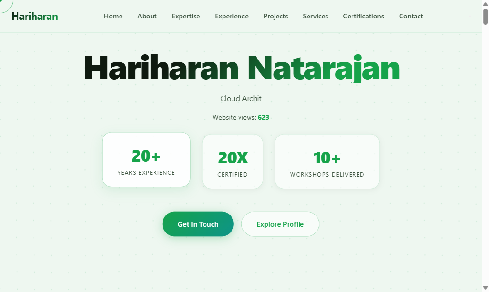
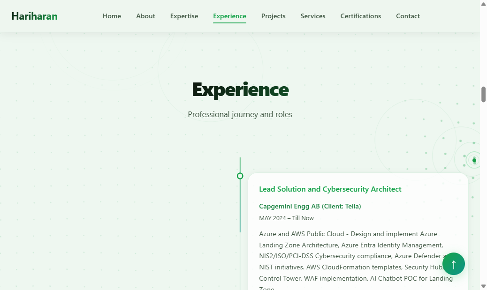
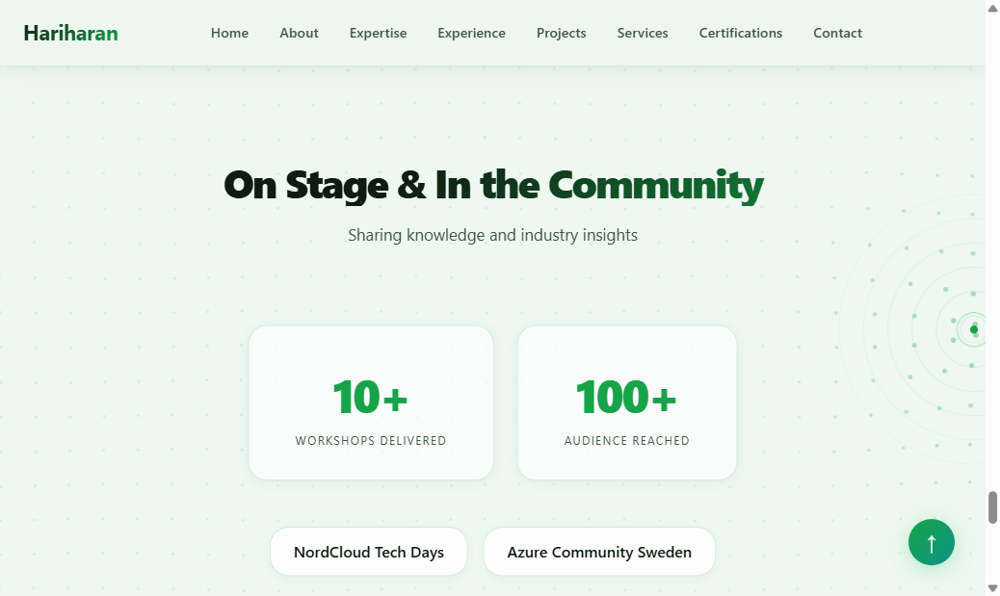
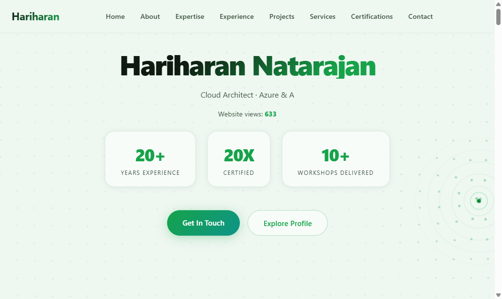
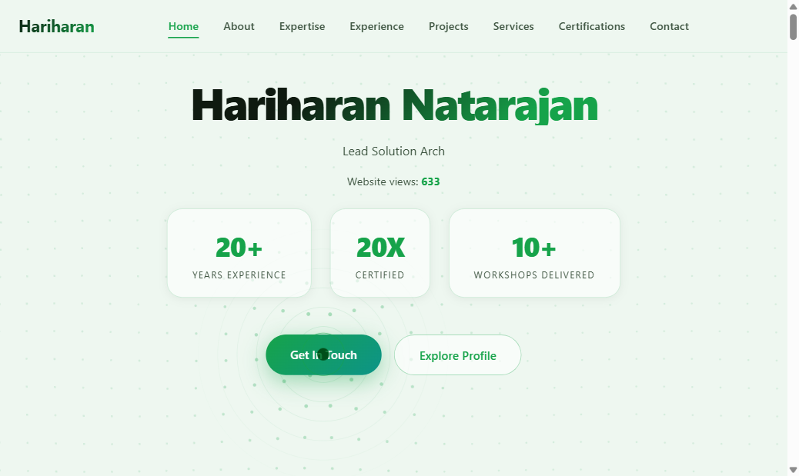
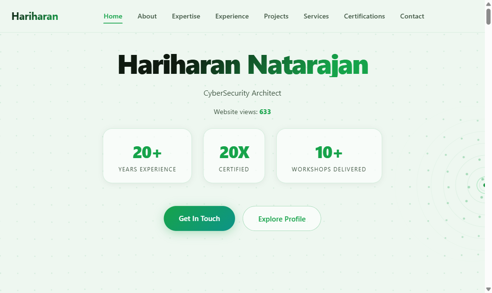
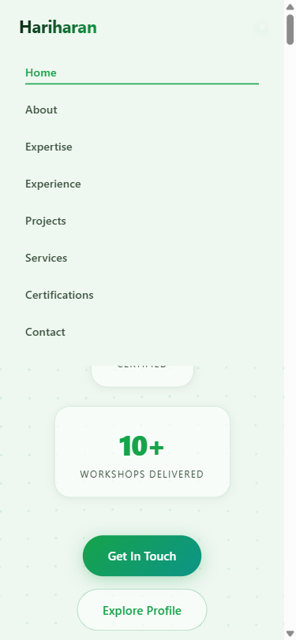

# Task Tracker

## Nav Link + Mobile Navigation Fix

- [x] Add `Certifications` link to top navbar (`templates/index.html`)
- [x] Fix mobile hamburger button — add JS click handler to toggle nav open/close (`static/js/main.js`)
- [x] Add `.nav-menu.open` CSS rule for mobile expanded state (`static/css/style.css`)
- [x] Regenerate static site (`python generate_static.py`)
- [x] Verify on desktop — Certifications link scrolls to section, active highlight works
- [x] Verify on mobile — hamburger opens/closes nav, links close menu on click
- [x] Commit and push to deploy

## Playwright MCP — UI Verification (Ongoing)

Use the `mcp__playright__*` tools to visually verify UI changes before committing. Run these checks after any change to `templates/`, `static/css/style.css`, or `static/js/main.js`.

### Checklist (run after each UI change)

- [ ] Start local Flask server (`python app.py` or `run.bat`)
- [ ] Navigate to `http://localhost:5000` via `mcp__playright__browser_navigate`
- [ ] Take a screenshot (`mcp__playright__browser_take_screenshot`) to confirm page loads correctly
- [ ] Check desktop nav — all links visible, active highlight on scroll (`mcp__playright__browser_snapshot`)
- [ ] Check mobile nav — resize to 375px (`mcp__playright__browser_resize`), open hamburger, verify menu opens/closes
- [ ] Click each nav link and verify it scrolls to the correct section
- [ ] Check Certifications section renders and is reachable via nav
- [ ] Review browser console for JS errors (`mcp__playright__browser_console_messages`)
- [ ] Capture network requests to confirm view count fetch succeeds (`mcp__playright__browser_network_requests`)
- [ ] Regenerate static site (`python generate_static.py`) and navigate to `docs/index.html` to verify parity
- [ ] Take final screenshot and compare with previous for regressions

---

## Stat Boxes Navigation — Playwright Test Evidence

**Task:** Make hero stat boxes (Years Experience, Certified, Workshops Delivered) clickable and navigate to their respective sections.

**Date:** 2026-04-29 | **Tool:** Playwright MCP (`mcp__playright__*`)

### 1. Hero section — stat boxes before clicking

> Three stat boxes rendered as anchor links with `cursor: pointer`. Visual appearance unchanged from previous `
` version.

### 2. Click "20+ Years Experience" → Experience section

> Page smooth-scrolled to the Experience section. Navbar "Experience" link highlighted in green.

### 3. Click "20X Certified" → Certifications section

> Page smooth-scrolled to the Certifications section. Navbar "Certifications" link highlighted in green.

### 4. Click "10+ Workshops Delivered" → Speaking section

> Page smooth-scrolled to the "On Stage & In the Community" speaking section showing workshops and events.

---

## Button Shadow Effects — Playwright Test Evidence

**Task:** Add visible box-shadow on hover and active/press states for `.btn-primary`, `.btn-secondary`, `.nav-toggle`, and `#back-top`.

**Date:** 2026-04-30 | **Tool:** Playwright MCP (`mcp__playright__*`)

### Test Summary

| Check | Status | Detail |
|---|---|---|
| Page loads (HTTP 200) | PASS | Title: Hariharan Natarajan - Portfolio |
| Nav links present (8 links) | PASS | Home, About, Expertise, Experience, Projects, Services, Certifications, Contact |
| Stat boxes are anchor links | PASS | hrefs: #experience, #certifications, #speaking |
| All section IDs exist (9) | PASS | home, about, expertise, experience, projects, services, certifications, speaking, contact |
| Years Experience → #experience scroll | PASS | scrollY: 3040 |
| Certified → #certifications scroll | PASS | scrollY: 7856 |
| Workshops → #speaking scroll | PASS | scrollY: 8981 |
| Mobile hamburger opens nav | PASS | .nav-menu has class "open", all 8 links visible |
| No JS console errors | PASS | 0 errors, 0 warnings |
| .btn-primary hover box-shadow | PASS | rgba(22,163,74,0.4) 0px 8px 30px (deeper than base 0px 4px 20px) |
| .btn-primary active box-shadow | PASS | rgba(22,163,74,0.55) 0px 12px 36px (deepest shadow) |
| .btn-secondary hover box-shadow | PASS | rgba(22,163,74,0.15) 0px 4px 16px (CSSOM confirmed) |
| .btn-secondary active box-shadow | PASS | rgba(22,163,74,0.28) 0px 6px 22px (CSSOM confirmed) |
| .nav-toggle hover box-shadow | PASS | rgba(22,163,74,0.18) 0px 2px 10px (CSSOM confirmed) |
| .nav-toggle active box-shadow | PASS | rgba(22,163,74,0.35) 0px 4px 16px + translateY(1px) |
| #back-top visible with transition | PASS | opacity: 1, transition: 0.35s cubic-bezier(0.4,0,0.2,1) |
| #back-top hover box-shadow | PASS | rgba(34,197,94,0.5) 0px 8px 30px (CSSOM confirmed) |
| #back-top active box-shadow | PASS | rgba(34,197,94,0.65) 0px 14px 40px (CSSOM confirmed) |

### Screenshots

#### 1. Baseline desktop

#### 2. btn-primary hover — green glow shadow visible

> "Get In Touch" button showing the expanded `0px 8px 30px rgba(22,163,74,0.4)` hover glow. Computed `boxShadow` verified via `getComputedStyle` while mouse was hovering.

#### 3. btn-secondary (Explore Profile) hover state

> CSS rule `.btn-secondary:hover { box-shadow: rgba(22,163,74,0.15) 0px 4px 16px }` confirmed via CSSOM. Subtle lift shadow applied on hover.

#### 4. #back-top button visible with shadow

> `#back-top` in `.visible` state (opacity: 1) with base `box-shadow: rgba(34,197,94,0.3) 0px 4px 20px`. Hover deepens to `0px 8px 30px` and active to `0px 14px 40px`. Transition: `0.35s cubic-bezier(0.4,0,0.2,1)` confirmed.

#### 5. Mobile nav open (hamburger test)

> `.nav-toggle` visible at mobile viewport 375x812. After click, `.nav-menu.open` class confirmed. Nav-toggle hover/active shadows also defined via CSSOM.
